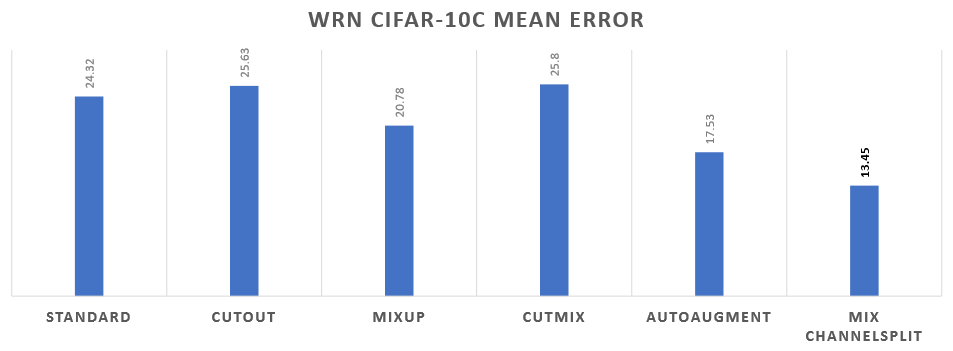
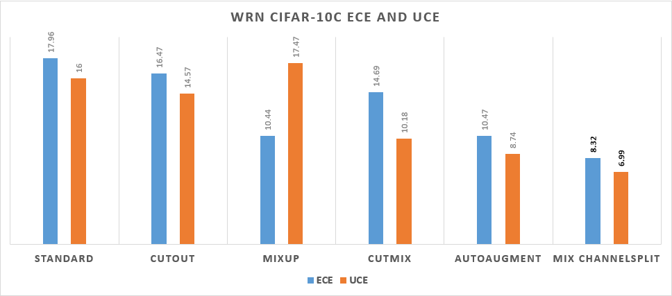

# The original repository of ChannelAug
불확실한 환경에서의 이미지 분류 성능 향상을 위한 Mix Channel Split 데이터 증강 기법

ChannelAug: A New Approach to Data Augmentation for Improving Image Classification Performance in Uncertain Environments

## Abstract
본 논문에서는 이미지 분류 모델의 불확실한 환경에서의 이미지 분류 능력 향상을 위해 이미지의 RGB채널 분리를 통한 새로운 데이터 증강 기법을 제안한다. 지금까지 제안된 데이터 증강 기법들은 이미지 분류 능력 향상에는 효과를 보이나, 불확실한 환경에서의 성능 향상은 없었다. 이러한 문제를 해결하기 위해 본 논문에서는 이미지의 RGB채널을 분리하여 다시 재조합 하는 ChannelSplit과 더 많은 다양성을 표현하기 위해 MixUp 의 개념을 채용한 Mix ChannelSplit을 제안한다. 본 논문에서 제안한 ChannelSplit과 Mix ChannelSplit은 다른 이미지 연산 없이 채널만을 이용한 기법임으로 ChannelAug로 통칭하도록 한다. 본 논문에서는 제안된 기법을 이용해 학습 이미지의 다양성을 증가시키고 모델의 불확실한 환경에서의 이미지 분류 능력 향상이 있음을 기존 데이터 증강 기법들과 비교하여 보인다.

We propose a new data augmentation method that works by separating the RGB channels of an image to improve image classification ability in uncertain environments. Many data augmentation methods, using technique such as flipping and cropping, have been used to improve the image classification ability of models. While these data augmentation methods have been effective in improving image classification, they have unperformed in uncertain conditions. To solve this problem, we propose the ChannelSplit that separates and reassembles the RGB channels of an image, along with the Mix ChannelSplit, that adopts the concept of MixUp to express more diversity. In this paper, the proposed ChannelSplit and Mix ChannelSplit are called ChannelAug because they only utilize channels and do not perform any other image operations. Also, we compare ChannelAug to other image augmentation methods to prove it enhances robustness and uncertainty measures on image classification.

## Requirements
*   numpy>=1.15.0
*   Pillow>=6.1.0
*   torch==1.2.0
*   torchvision==0.2.2

## Usage
Wide ResNet: `python train.py`

ResNeXt: `python train.py -m resnext`

DenseNet: `python train.py -m densenet`

## Download CIFAR-C for Experiments
    CIFAR-10-C: https://zenodo.org/record/2535967/files/CIFAR-10-C.tar
    CIFAR-100-C: https://zenodo.org/record/3555552/files/CIFAR-100-C.tar
    Default Path => ./data/cifar/CIFAR-10-C or ./data/cifar/CIFAR-100-C
    *you can change the corruption images path by using the "--corruption_path" option.

## Results
### The Mean Errors of the Wide ResNet on CIFAR-10C

### The ECE and UCE of the Wide ResNet on CIFAR-10C

## Contact
titania7777@gmail.com
